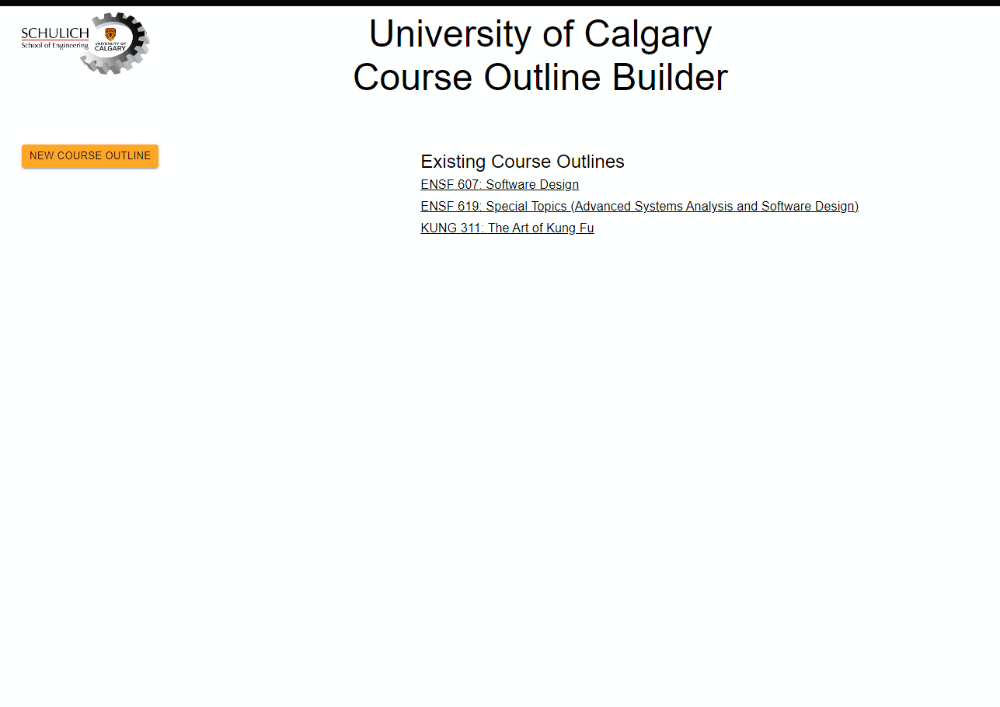

# ENSF607WebDev

# About
React and Django based web application for building a section of a course outline for the University of Calgary. Required to have the front end allow for CRUD operations with the RESTapi backend. Front End code located in Milestone1, Back End code located in Milestone2 folder.  

# App Demo

# Dependencies
1. React.js
2. Node.js
3. Django

# Installing the app
## Front End
1. Clone repository
2. Navigate to "Milestone1/course-outline/"
3. Run `npm install`
4. Run `npm start`

## Back End
1. Navigate to "Milestone2/courseoutline/
2. Run `python manage.py runserver`
2. Open another terminal, Run `python manage.py makemigrations`
3. Run `python manage.py migrate`
